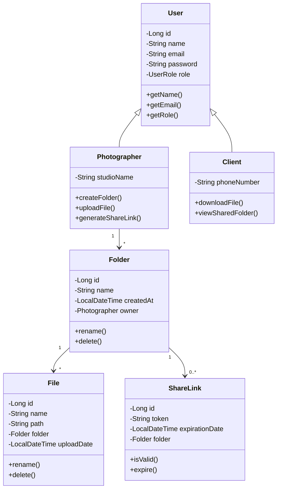

# 📸 PhotoVault


> **PhotoVault** é uma plataforma de gerenciamento, backup e compartilhamento de fotos criada para **fotógrafos** e **clientes**.  
> O objetivo é oferecer uma solução segura e prática para armazenar, tratar e disponibilizar imagens por meio de links controlados.

---

## 🧭 Visão Geral do Produto

### 🎯 Propósito
Permitir que fotógrafos enviem, organizem e compartilhem fotos com seus clientes de forma simples e segura — centralizando o fluxo de trabalho (captura → edição → entrega).

### 👥 Usuários Principais
- **👨‍💻 Fotógrafo** — faz upload, organiza pastas e gera links de acesso.
- **👤 Cliente** — visualiza e baixa fotos compartilhadas.

---

## 🧱 Arquitetura do Sistema

O sistema segue uma **arquitetura em camadas (API RESTful)** utilizando **Spring Boot no backend** e **Angular no frontend**, com integração aos serviços da **AWS**.

```
Frontend (Angular)
    ↓
API REST (Spring Boot)
    ↓
Banco de Dados (PostgreSQL / AWS RDS)
    ↓
Armazenamento de Arquivos (AWS EFS)
```

---

## 🗂️ Diagrama de Classes (Mermaid)



---

## 🧩 Stack Tecnológica

### 🔙 Backend
- Java **25**
- Spring Boot **3.x**
- Spring Security (JWT)
- Spring Data JPA
- PostgreSQL (RDS)
- AWS SDK (EFS, S3, CloudFront)

### 🎨 Frontend
- Angular **17**
- TailwindCSS
- Axios / HttpClient
- JWT Authentication

### ☁️ DevOps / Infra
- AWS ECS (Fargate)
- AWS RDS (PostgreSQL)
- AWS EFS (armazenamento)
- AWS CloudFront + S3 (frontend)
- GitHub Actions (CI/CD)
- CloudWatch (monitoramento)

---

## 🚀 Execução Local (Desenvolvimento)

### Pré-requisitos
- [Java 25](https://jdk.java.net/25)
- [Maven 3.9+](https://maven.apache.org/)
- [Docker](https://www.docker.com/)
- [PostgreSQL](https://www.postgresql.org/)
- [Node.js + npm](https://nodejs.org/) (para o frontend)

### Passos
```bash
# 1. Clonar o repositório
git clone https://github.com/Viniciustertuliano/photovault.git
cd photovault

# 2. Backend
cd backend
mvn spring-boot:run

# 3. Frontend
cd ../frontend
npm install
npm start
```

Acesse:
- **API:** `http://localhost:8080`
- **Frontend:** `http://localhost:4200`

---

## 🧠 Metodologia de Desenvolvimento

O projeto segue a metodologia **Scrum com micro-sprints**, ideal para aprendizado e entregas incrementais.

| Fase | Sprint | Foco | Duração |
|------|--------|------|----------|
| Backend | 1 | Estrutura e autenticação | 1 semana |
| Backend | 2 | Sistema de arquivos (EFS) | 1 semana |
| Backend | 3 | Compartilhamento e links | 1 semana |
| Frontend | 4 | Login e base visual | 1 semana |
| Frontend | 5 | Upload, pastas e links | 1 semana |
| DevOps | 6 | Deploy e monitoramento | 1 semana |

**Total:** 6 semanas — micro-sprints curtos e objetivos.

---

## 🏗️ Estrutura de Pastas

```
photovault/
├── backend/
│   ├── src/main/java/com/photovault/
│   │   ├── config/
│   │   ├── controller/
│   │   ├── entities/
│   │   ├── repository/
│   │   ├── service/
│   │   └── PhotoVaultApplication.java
│   └── pom.xml
│
├── frontend/
│   ├── src/
│   ├── package.json
│   └── angular.json
│
├── docker/
│   ├── backend.Dockerfile
│   ├── frontend.Dockerfile
│   └── docker-compose.yml
│
└── README.md
```

---

## 🧾 Backlog (Resumo das Sprints)

### 🏁 Sprint 1 — Configuração e estrutura base
- Configurar projeto Spring Boot com dependências (Web, JPA, Security, AWS SDK)
- Criar entidades: `User`, `Photographer`, `Client`
- Configurar PostgreSQL
- Implementar autenticação JWT

### 💾 Sprint 2 — Sistema de arquivos e upload
- Entidades: `Folder`, `File`
- Integração AWS EFS
- Endpoints de upload/download
- Controle de acesso via token

### 🔗 Sprint 3 — Compartilhamento e links
- Entidade: `ShareLink`
- Geração de links temporários
- Scheduler para expiração automática

### 💻 Sprint 4 e 5 — Frontend
- Login, dashboard e upload
- Listagem de pastas e links compartilhados

### ☁️ Sprint 6 — Deploy e monitoramento
- Dockerfiles (backend + frontend)
- Deploy AWS ECS + RDS + EFS
- CI/CD com GitHub Actions
- Monitoramento CloudWatch

---

## 🧑‍💻 Autor

**Vinicius Tertuliano da Silva**  
Desenvolvedor Java e entusiasta em AWS ☁️  
📍 Baseado no Brasil 🇧🇷  
📧 [viniciustertulianodasilva@hotmail.com](mailto:viniciustertulianodasilva@hotmail.com)  
🔗 [LinkedIn](https://www.linkedin.com/in/viniciustertulianodasilva) • [GitHub](https://github.com/viniciustertuliano)

---

## 📜 Licença

Este projeto está licenciado sob a [MIT License](LICENSE).

---

> “A simplicidade é o último grau de sofisticação.” — *Leonardo da Vinci*
